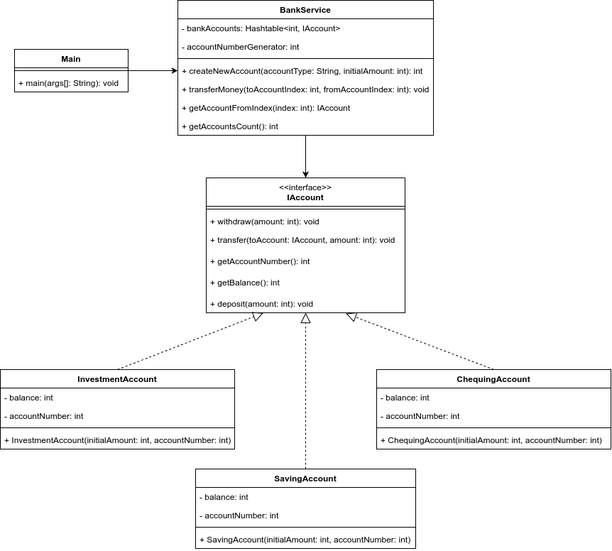

# Lab Assignment 3: Write a Java program to demonstrate the implementation of a façade design pattern for a Banking Service with Checking, Saving, and Investment modules.

## Class Diagram

## Structure of the Program

1. `IAccount` interface: names all the common methods for different types of accounts.
1. `ChequingAccount` class: implements the `IAccount` interface with functionalities for the chequing account.
1. `SavingAccount` class: implements the `IAccount` interface with functionalities for the saving account.
1. `InvestmentAccount` class: implements the `IAccount` interface with functionalities for the investment account.
1. `BankingService` class: provides services related to creating any types of account, keeping track of account and transfering money between accounts 
1. `Main` class: contains the `main` method and demonstrates the facade design pattern

## Ouput
The output of the demo program can be found inside <a href="Out.txt">Out.txt</a>